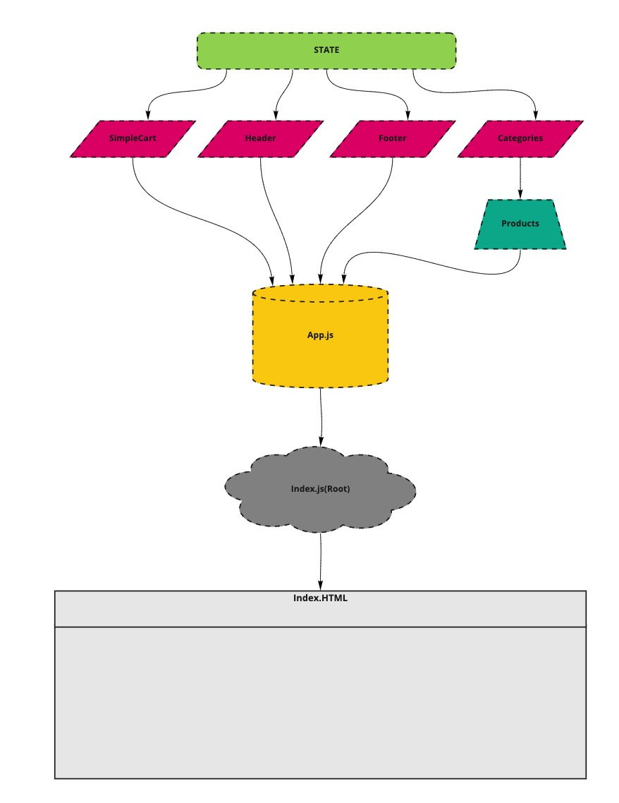
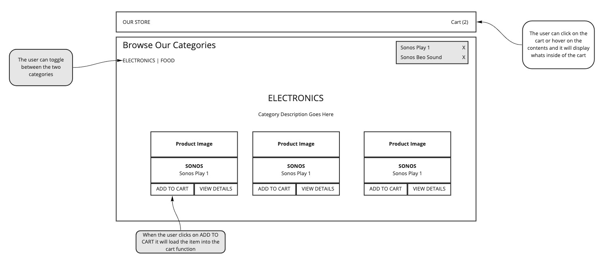

# Redux Practice with React

**Phase 1**

1. Virtual Store Phase 1: For this assignment, you will be starting the process of creating an e-Commerce storefront using React with Redux, coupled with your live API server.

## Storefront Lab

### Author: Jason Taisey

#### Links & Resources

- [Github](https://github.com/JTaisey389/storefront)

- [Pull Request](https://github.com/JTaisey389/storefront/pulls)

- [Deployed Site](https://60c0424506d4b360dcbf25f1--adoring-knuth-003df7.netlify.app/)

#### UML

#### User Stories

**Phase One**

- As a user, I expect to see a list of available product categories in the store so that I can easily browse products

- As a user, I want to choose a category and see a list of all available products matching that category

- As a user, I want a clean, easy to use user interface so that I can shop the online store with confidence

**Phase Two**

- As a user, I want to choose from products in the list and add them to my shopping cart
- As a user, I want to see the products that I’ve added to my shopping cart so that
- As a user, I want to change the quantity of items I intend to purchase in my shopping cart
- As a user, I want to be able to remove an item from my shopping cart

### Architecture

1. Begin with creating your application using create-react-app
2. Install Material UI as a dependency
3. Write an App component that serves as the container for all sub-components of this application
  
- A <Header> component which shows the name of your virtual store

- A <Footer> component which shows your copyright and contact information
  
- A <Categories> component
  - Shows a list of all categories
  - Dispatches an action when one is clicked to “activate” it

- A <Products> component
  - Displays a list of products associated with the selected category

### Notes

- Categories
  - State should contain a list of categories as well as the active category
    - Each category should have a normalized name, display name, and a description
  - Create an action that will trigger the reducer to change the active category
  - Update the active category in the reducer when this action is dispatched
- Products
  - State should be a list of all products
    - Each product should have a category association, name, description, price, inventory count
  - Create an action that will trigger when the active category is changed
  - HINT: Multiple reducers can respond to the same actions
  - Create a reducer that will filter the products list based on the active category
  - Active Category
- State should store active category
  - Other components (products, etc) might need to reference this
